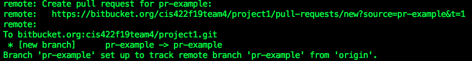
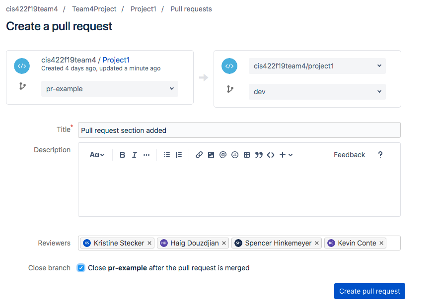

# :computer: Developer Onboarding Guide #

## Prerequisites ##

Add your SSH key to your Bitbucket account so that you don't have to keep typing your username and password for each git push.

1. Copy your public SSH key
    * `cat ~/.ssh/id_rsa.pub`
    * Copy the output of this command.

2. From Bitbucket, choose **Bitbucket settings** from your avatar in the lower left. The **Account settings** page opens.

3. Under the **Security** section, click **SSH keys.**

4. Click the **Add key** button.

5. Paste your key.

6. Click **Save**.

7. Check if it worked in terminal.
    * `ssh -T git@bitbucket.org`
    * You should see that you're logged in as your username.

8. Now you can use the SSH URL next time you clone the repo.

## Branch Structure ##

We are using 2 main branches.

1. `master`
    * This is our production branch. Everything that has been tested is put here for release.

2. `dev`
    * This is our development branch. All feature branches get merged here for testing.

## Git Workflow ##

1. Clone the repo.
    * `git clone git@bitbucket.org:cis422f19team4/project1.git`
    * You only have to do this once. You should start from step 2 after that.

2. Fetch the latest changes.
    * `git fetch`

3. Checkout the development branch
    * `git checkout dev`

4. Create a new branch for your feature
    * `git checkout -b feature-name dev`
    * This creates a new branch named `feature-name` based off of the `dev` branch. It automatically switches you to the new branch so you are now ready to work.

5. Make your changes.

6. Commit your changes.
    * All commits should be written in past tense. For example:
        * "Export feature added"
        * "Import test added"
        * "UI bug squashed"
        * "Readme updated"

7. Push your changes.
    * `git push -u origin feature-name`
    * This pushes your feature branch up to the repo on Bitbucket.

8. Open a pull request on Bitbucket.

## Pull Requests ##

Pull requests should be kept small so that they are easy to review.

When you push your feature branch up to Bitbucket, it will give you a link to open a PR:

When you open the link you will get this page:

Here we can see that I want to merge the `pr-example` branch into the `dev` branch.

At least 2 other team members will have to review and approve this PR before it gets merged.

Ensure the the *Close branch* checkbox is checked so that the feature-branch get deleted after it gets merged into `dev`. This keeps the repo clean.
